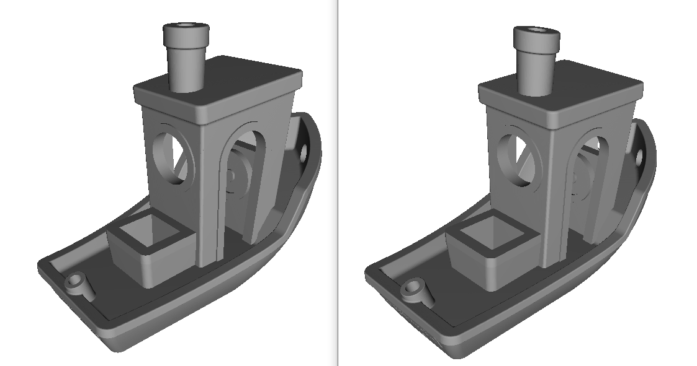
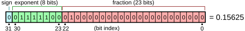
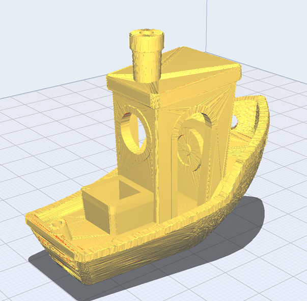
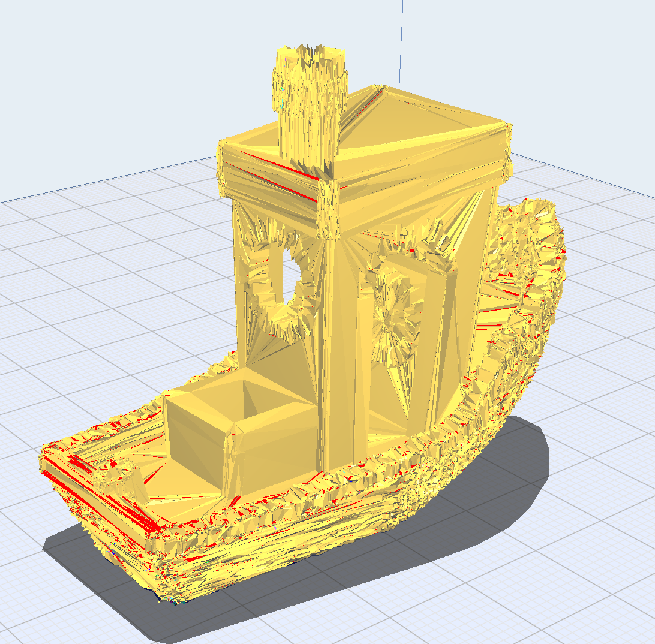
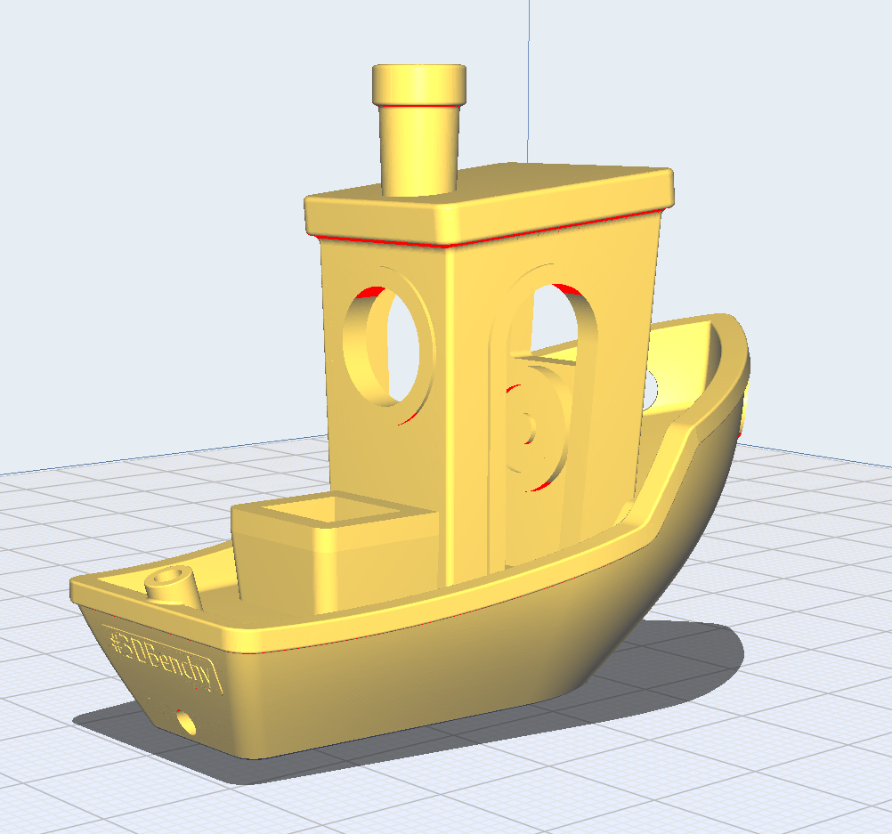

# stegaSTL
Experimental tools embedding data (steganography) in 3D STL models

# Introduction
Can you spot a difference between these two Benchy models?

The model on the right has a puffin in it, but you wont spot it in a model viewer or notice that the file is any different than the default Benchy via simple review of the file.

 

<small>Puffin photo By Richard Bartz - Own work, CC BY-SA 3.0, https://commons.wikimedia.org/w/index.php?curid=27624174</small>

Using the tools in this project, [this image](demo_files/puffin.jpg) was embedded within the geometry data of a standard-issue [3D Benchy](demo_files/3DBenchy.stl), creating a [new STL model file](demo_files/3DBenchy_Embedded_Puffin.stl) that for all intents and purposes is still a perfectly functional Benchy model. The new STL is the exact same size as the original file, and will load in any model viewer, slicer or 3D Modelling program with no indication that there is a JPEG image buried in its data -- unless you know how to look for it.

This is an implementation of the concept of [steganography](https://en.wikipedia.org/wiki/Steganography) within the context of a STL 3D model file - hiding arbitrary information within the structure of the STL format, so it can be retrieved by a process that is capable of reconstructing it.

Oh, also it was my excuse to learn Rust. Forgive newbie mistakes if you find them.

## Prove it
You can [download](https://github.com/jsbohnert/stegastl/releases) or build the Rust project here and use the `data` executable to extract the image from `3DBenchy_Embedded_Puffin.stl` - you just need to know a few pieces of info about the enhanced STL file - the "bit depth" the data is encoded at (more on this later in this doc), which in this case is `5`, and the filename you want to output to (since you know you're expecting a JPEG image, might as well name it a `.jpg` file.)

    # data decode demo_files/3DBenchy_Embedded_Puffin.stl puffin_out.jpg 5
        File: demo_files/3DBenchy_Embedded_Puffin.stl
        Tris: 225706
        Vertices: 112662
        Header read, payload bytes: 204881
        Writing 204881 bytes of data to output file puffin_out.jpg
        Decode complete.
        
    # md5sum puffin_out.jpg demo_files/puffin.jpg
        bfa4248c0b641e814a51a95530865334  puffin_out.jpg
        bfa4248c0b641e814a51a95530865334  demo_files/puffin.jpg

Pretty neat.

# Inspiration

This topic came to mind after watching Angus Deveson's (Maker's Muse) YouTube video [How to obscure 3D models for fun or profit.](https://www.youtube.com/watch?v=aMLdy_USwXU). The topic of the video was exploring some creative ways to manipulate 3D modelling files within a 3D printing context to achieve a sort of 'watermark' or 'security by obscurity' level of manipulation.  MM's ideas were fun but the notion occured to me that playing within the mechanisms of 3D modeling would at least always leave some very observable evidence that you did something to the file.

I started thinking about whether 3D models, often shared broadly and publicly, could be used as a method for really obscuring data and potentially even being used to transmit cryptographically secure data within a "carrier" file format. In this way, a completely innocuous 3D model of some object (a boat, a toy, etc) could contain secret messages or private watermark data, while still being perfectly functional for its original purpose (3D printing real objects from the model).
Alternatively, these tools could be used as part of fun activities like digital scavenger hunts or ARGs.

This project is the result of my experiment.

# Solution Overview - Why It Works

## Concept
In reality, a binary STL file is essentially a list of triangles, and each triangle is a list of 3 3D points in space (Vertices). Simplified (you can look up the details of the format elsewhere)

* File Header
* List of Triangles:
    * Repeating:
        * Triangle Normal
        * Triangle Vertex 1
        * Triangle Vertex 2
        * Triangle Vertex 3
     
To describe a (useful) 3D shape, many triangles will be used that will form a mesh, where vertices join edges together forming a closed shape. In other words, every vertex in every triangle will appear in at least 2 triangles. For example, a simple cube requires 2 * 6 (12) triangles encompassing 8 unique vertices :

StegaSTL uses the vertex data to hide payloads, relying on the notion that the amount of bits uses by the data format to represent 3D coordinations is likely overkill for the precision required to do the kinds of modelling useful to 3D printing enthusiasts. Really this is the core conceit of the implementation.

## Abusing STL Vertex Representation - ruining your data for fun

Each vertex in a binary STL is represented by three 32-bit values, representing X, Y, Z coordinates.

The X,Y,Z vertices are each a 32-bit IEEE 754 floating-point number. To visualize it, each triangle vertex uses three of these:
 

<small>(image by Fresheneesz at the English Wikipedia project, CC BY-SA 3.0, https://commons.wikimedia.org/w/index.php?curid=3357169)</small>

If you imagine each bit on the right-hand side (the lowest bits) as carrying deeper precision in the original coordinate, then you can imagine that changing the last couple of those bits around effectively "wiggles" the point around its original, intended coordinate.

Do it to all three coordinates (X/Y/Z) then you can imagine a 3D point in your original model jittering around somewhere near, but not too far, from its original location.

Depending on how precise your model is in its internal notation, and how complex the mesh is, you could probably imagine that EVERY point on your model could wiggle around, just a little, in 3D space and still functionally be the same model - in fact it might visually and practically seem no different at all.

But, if you take it too far - if you muddle too many bits, and you move the data around significantly enough that it either obviously looks like it has been manipulated:

Or, with enough bits changed, it breaks down entirely and becomes essentially nonsense - no longer passes for a copy of the original object:

However, if we've established that some number of bits are "available" for random change without invalidating your model, then those bits are usable space for arbitrary data.

## How StegaSTL manages the data

- Take some number B, for "bit depth". This is how many lowest bits from the end of each vertex's coordinates the tool will use for data storage.
- Read in the entire model, and generate a list of unique vertices - X/Y/Z values at each point of each triangle.
- Each unique coordinate encountered is stored in a lookup table, and in a list representing the order it was first encountered (thereby creating a natural order to the coordinate data based on the ordering of the data in the file)
- Once every unique vertex is identified, take in the data to be encoded.
- Proceeding linearly through the file, treat each coordinate of each vertex as a bitstream
  - 3*B bits are available on each vertex
  - if bits remain in the data to be encoded, take bits in-order from that data, and replace the B lowest bits of the vertices (X,Y,Z) with the next available bits of our data.
  - Once all available bits of a vertex have been used, save its "encoded" value in the lookup table associated with the vertex's original values
  - Proceed through the file until all bytes of data have been rewritten.
- With all data encoded, rewrite the STL file to disk:
  - Following the vertices in the original source file
  - Look up the "new" coordinate values of each vertex, and output each triangle with its adjusted vertices

By following the natural order of the file, using "order of first encounter with each unique vertex", and outputting the resulting STL with its NEW vertices following the exact same ordering, the resulting file can be "Decoded" by following the same pattern:
 - Identify each unique vertex, in order
 - For each coordinate, X/Y/Z in order,
 - Take B bits, in order
 - and consume them as a bitstream until all data has been recovered.

One detail remains: knowing how much data is present in the file.

Since the data may be compressed, or cryptographically protected, theres no simple way to know that data is even present in the file, let alone how many bytes exist.

For this reason, one concession is made in the design: at time of encoding, the first 8 bytes of data written into the vertex bits encodes a 64bit number indicating how many bytes of data follow, comprising the payload to be decoded and output.
 
This ostensibly removes some of the "security by obscurity" from the implementation, since someone could potentially look for suspiciously accurate numbers encoded at various "bit depths" to see if the file might contain something. However, I think this is a reasonable tradeoff for this tool because:

 - This is a toy implementation, and making it actually usable by only needing to know your "bit depth" makes it easier to play with
 - If someone actually wanted to use this for real concealment they would probably rewrite it to not encode a tattletale header and rely on external knowledge about how they intend to include data as payloads

However, this is what will let you encode anything you want by simply knowing the file will fit in your chosen bit depth, and providing that bit depth value at both encode and decode time.

## So how much data can you put in a Benchy?

That depends on how much risk you're willing to take that your model will look weird, or not pass muster in a slicer.

The example at the top of this document encodes data at a bit depth of `5`. That is, the lowest 5 bits of each unique vertex-coordinate is considered available for data storage.

The benchy has `225,706` triangles described by `112,662` vertices.

At 5 bits each, that comes to a total of `1689930` bits, or just about `211` Kilobytes of data.
 
Not a lot by modern web standards, but more than enough to hold the entirety of Shakespeare's "Hamlet" in ASCII text, or over a minute of mono MP3-compressed audio recording.

### How far can I go?

The `inspect` tool, run on the 3D Benchy model, suggests 8 bits of data should be doable without disrupting the validity of the file, so lets give it a try:

- at bit depth `8` we could stuff `337986` bytes (`337` Kilobytes) of data into the benchy.
- `337978` bytes after leaving 8 bytes for the header bytecount
- Thats approximately 1.76 Hamlet's worth of data, and thats what we'll do.

Looks good. Slices without errors. 

Something is hidden in the state of benchmark.

## Homework

This repository contains another test file for you to try, if you want a fun second example.

Take a look at [this file](demo_files/3DBenchy_Stego_Demo.stl). Try decoding it at bit depth `5`. See if you can work out what the secret embedded file is and how to experience its content. Hint: its a piece of media and safe for work and your computer - promise. 
 

# Tools Overview

Each tool will provide `--help` info for its invocation on the commandline.

## inspect

Provides a glance of the data availability of a model file, and tries to guess what bit depths could be usable to you, and how much storage it would provide.

    Evaluates STL model files for viable bit-encoded capacity

    Usage: inspect <file> <max_bits>

    Arguments:
      <file>
      <max_bits>

    Options:
      -h, --help  Print help

Example:

    ./inspect ../../demo_files/3DBenchy.stl 12

    File: ../../demo_files/3DBenchy.stl
    Tris: 225706
    Vertices: 112662
    Encoding bits check:
    Bits          Safe Encodable Bits  (Bytes)
    1             true         337986    42248
    2             true         675972    84496
    3             true        1013958   126744
    4             true        1351944   168993
    5             true        1689930   211241
    6             true        2027916   253489
    7             true        2365902   295737
    8             true        2703888   337986
    9            false        3041874   380234
    10           false        3379860   422482
    11           false        3717846   464730
    12           false        4055832   506979

The `Safe` column is a sanity check, and not a promise. It is trying to make an educated guess of whether the indicated bit-depth would distrupt the geometry enough to be noticeable.

Currently, all this does is 0-out all the storage bits on all the vertices in the file, and if this causes the list of unique vertices to become unreliable (by collapsing two originally distinct points to be coincident) then it presumes that manipulating those bits could cause the vertices to scramble in 3d space past the point of coherence.

In my tests, it works as a decent fast check.

## data

The intended "workhorse" utility. Encodes and decodes any arbitrary data file in/out of an STL model file.

Encode

    Usage: data encode <in_file_path> <out_file_path> <data_file_path> <bits>

    Arguments:
      <in_file_path>
      <out_file_path>
      <data_file_path>
      <bits>

    Options:
      -h, --help  Print help

Decode

    Usage: data decode <in_file_path> <out_file_path> <bits>

    Arguments:
      <in_file_path>
      <out_file_path>
      <bits>

    Options:
      -h, --help  Print help

Example:

    # encode

    ./data encode 3DBenchy.stl ./benchy_with_data.stl puffin.jpg 5
    File: 3DBenchy.stl
    Tris: 225706
    Vertices: 112662
    5-bit encoding 204889 bytes of data incl header
    5 bits of storage provides 211241 bytes of stored data incl header
    Writing file ./benchy_with_data.stl

    # decode

    ./data decode ./benchy_with_data.stl ./payload.jpg 5
    File: ./benchy_with_data.stl
    Tris: 225706
    Vertices: 112662
    Header read, payload bytes: 204881
    Writing 204881 bytes of data to output file ./payload.jpg
    Decode complete.

## text

Text is just data, but since it might be specifically interesting in the "watermark" scenario to simply want to embed a recognizable text string, the `text` utility takes any text string you provide, and embed it in the STL file, optionally repeating it a number of times to be redundantly found in the data. 

On the decode side, this tool understands you want to see text, so instead of writing out a file, it prints out the discovered text.

Encode

    Usage: text encode [OPTIONS] <in_file_path> <out_file_path> <text> <bits>

    Arguments:
      <in_file_path>
      <out_file_path>
      <text>
      <bits>

    Options:
          --times <times>  [default: 1]
      -h, --help           Print help

Decode

    Usage: text decode <in_file_path> <bits>

    Arguments:
      <in_file_path>
      <bits>

    Options:
      -h, --help  Print help

Example:

    ./text encode ./3DBenchy.stl ./benchy_with_watermark.stl "Created by a great guy." 5 --times 10
    File: ./3DBenchy.stl
    Tris: 225706
    Vertices: 112662
    5-bit encoding `Created by a great guy.` 10 times for 238 bytes of text incl header
    5 bits of storage provides 211241 bytes of stored data incl header
    Writing file ./benchy_with_watermark.stl

    ./text decode ./benchy_with_watermark.stl 5
    File: ./benchy_with_watermark.stl
    Tris: 225706
    Vertices: 112662
    Header read, payload bytes: 230
    ======== BEGIN ENCODED MESSAGE ========
    Created by a great guy.Created by a great guy.Created by a great guy.Created by a great guy.Created by a great guy.Created by a great guy.Created by a great guy.Created by a great guy.Created by a great guy.Created by a great guy.
    ======== END ENCODED MESSAGE ========

## noise

A testing/assessment tool, `noise` will help evaluate your STL file for actual suitability of encoding data at various bit depths.

It will perform a test run, outputting multiple edited copies of the source STL at different bit-depths (Starting at 1 and incrementing to a maximum you specify).

The data encoded is random noise, to "stress test" the model. With its output you can visually inspect your STL, evaluate it in a slicer, etc to help see the effects different bit-depth choices have on the value of your model as a printable model after manipulation.

    Fuzzes STL file with random data in desired encode bit ranges, outputs sample files for inspection

    Usage: noise <file> <prefix> <max_bits>

    Arguments:
      <file>
      <prefix>
      <max_bits>

    Options:
      -h, --help  Print help

Example:

    ./noise ./3DBenchy.stl noisy_benchy 10
    File: ./3DBenchy.stl
    Tris: 225706
    Vertices: 112662
    Writing file noisy_benchy_1.stl for 1 encoded bits
    Writing file noisy_benchy_2.stl for 2 encoded bits
    Writing file noisy_benchy_3.stl for 3 encoded bits
    Writing file noisy_benchy_4.stl for 4 encoded bits
    Writing file noisy_benchy_5.stl for 5 encoded bits
    Writing file noisy_benchy_6.stl for 6 encoded bits
    Writing file noisy_benchy_7.stl for 7 encoded bits
    Writing file noisy_benchy_8.stl for 8 encoded bits
    Writing file noisy_benchy_9.stl for 9 encoded bits
    Writing file noisy_benchy_10.stl for 10 encoded bits

# Uncertainties and known issues

Because this is a toy implementation, it was a "can I do it and does it pass the sniff test" type of thing.

Limitations and suspicions I currently acknowledge:

 - This is not a copyright protection scheme, its a obfuscation and exfiltration method. As easily as the data was encoded it can be erased, by something as simple as moving the model in coordinate space and re-saving it. To that extent, its value as a "watermark" lies in its obscurity.
 - I did not test this on a massive array of model files from different sources. Maybe its less universally useful than I expect and more prone to making unusable models than I think. Hopefully what this would mean in real terms is that it is safer to work at small bitdepths (1 or 2) instead of pushing as much data as possible into a model.
 - There is no specific mechanism trying to make sure the model is still coherent after being manipulated. Maybe there are combinations of input files that "should" work together but conspire to break down by creating collisions in the vertex lookup table
 - I think to be most believable, a real implementation should re-calculate the vertex normals. I think in the world of 3D printing slicers this might not be needed to keep the model printable, but it may be needed to preserve deniability that the file has been manipulated.
 - This is a creative exercise, not a mathematical proof. No assertions are made of any kind.

# Attributions and License
Project code and benchy images published under the MIT License.

Where noted, some image files included in this repo for this document are used and shared under CC licenses - the are attributed and shared under same as required.

Please see [this file](demo_files/attributions_and_licenses.txt) for all license and attribution notes for non-original files used in this project's demo files and this documentation

# Final word

Use this tool in good faith and share knowledge willingly. Always remember, when obscuring sensitive information, assume that the methods of obscurity are known - no amount of obscurity guarantees security - use real cryptography for sensitive data no matter where you hide it.
